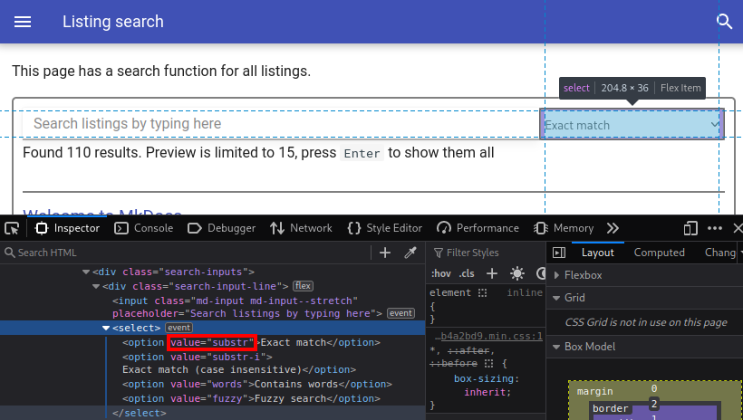

# mkdocs-extract-listings-plugin

A small plugin to extract all your listings and put them in a single page.
It can also generate a search function of code listings with different search methods (fuzzy match, substring, contains words).

## Demo

You can try out the demo at <https://mkdocs-extract-listings-plugin.six-two.dev>.
It is configured to offer both the search and all listings pages an uses the plugin with some common MkDocs themes (mkdocs, readthedocs, and material).
The source for this demo is also in this repo (`mkdocs.yml`, `docs/` and `build.sh`).

## Setup

1. Install the plugin using pip:

    ```bash
    pip install mkdocs-extract-listings-plugin
    ```

2. Add the plugin to your `mkdocs.yml`:

    ```yaml
    plugins:
    - search
    - extract_listings
    ```

    > If you have no `plugins` entry in your config file yet, you'll likely also want to add the `search` plugin. MkDocs enables it by default if there is no `plugins` entry set.

    More information about plugins in the [MkDocs documentation](http://www.mkdocs.org/user-guide/plugins/).

3. Configure a page with all listings, a page with listing search, or both (see below).

### Listing page

Add a Markdown file for the page that will be filled with all the listings.
In that file add the placeholder where the listings should be inserted.
Then reference that file and specify the placeholder like this in your `mkdocs.yml`:
```yaml
plugins:
- extract_listings:
    listings_file: listings.md
    placeholder: PLACEHOLDER_LISTINGS_PLUGIN
```

### Listing search

1. Create a page, which should contain the search function.
2. Add a tag where the search elements should be inserted and load the search script:
    ```markdown
    <div id="listing-extract-search"></div>
    <script src="/listing-search.js">
    ```
3. Specify where you want the plugin to write the script file to.
This should match the path you used in the previous step.
    In `mkdocs.yml`:

    ```yaml
    plugins:
    - extract_listings:
        javascript_search_file: listing-search.js
    ```

## Configuration

You can configure the plugin like this:
```yaml
plugins:
- extract_listings:
    listings_file: listings.md
    placeholder: PLACEHOLDER_LISTINGS_PLUGIN
    javascript_search_file: listing-search.js
    default_css: true
    offline: false
```

### default_css

`default_css` determines, whether the search JavaScript should also load the default styling for the search dialog and results.
By default it is set to `true`, but you can set it to `false` if the theme you use does not work well with the style.
You should then define your own custom style and include it on the search page.
Also has some effect on the all listings page.

### listings_file

`listings_file` is expected to contain the relative path to the Markdown file, where the listings should be written to.
If the file does not exist, an error will be raised during the build process.
The default value is empty.

### placeholder

The value for `placeholder` will be searched in the file referenced by `listings_file` and be replaced with the list of all listings.

### javascript_search_file

The JavaScript code for the search function will be written to this path.
The default value is empty, meaning that neither the JSOn file nor the JavaScript are generated.

### offline

When set to `true` the listing data is included into the JavaScript file.
This way it can be used even when the site if opened from the file system (via a `file://` URL).
The disadvantage is that the loading of the script will take longer and the data is not loaded asynchronously, so the loading of the page via the Internet will be delayed.
Because of that it is set to `false` by default.

### Search mode

You can set the search mode via the `data-serachmode` attribute:
```html
<div id="listing-extract-search" data-searchmode="substr"></div>
```

To see all current valid values inspect the search type dropdown menu using your browser's developer tools.
The data in the `value` attribute is the value you should put in the attribute:



Alternatively you can put in a random value and will receive an warning message in the developer tools, that also lists the valid values (but without descriptions).


## Changelog

### Version 0.1.0

- The plugin should now be able to work when served from `file://` URLs:
    - Search JSON can be inlined to the script via `offline: true` setting.
    - Use relative links on the `listings_file` page.
- Improved the search code:
    - Allow users to specify which matching mode the search uses by default.
    - Added mode `Contains words (case insensitive)`.
- Fixed crash when using `use_directory_urls: false` and not setting `listings_file`.

### Version 0.0.4

- Added styling for the search page and the option `default_css` to disable it.
- Fixed bug: URL for index pages starts with `//`

### Version 0.0.3

- Added snippet search JavaScript and JSON file.
- Changed default for `listings_file` to empty string.

### Version 0.0.2

- Fixed `Unknown path` being shown on with different themes (`readthedocs` and `material`)
